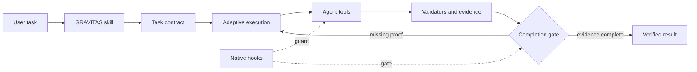

# GRAVITAS

**Claude-like engineering discipline for Gemini — measured, not claimed.**

GRAVITAS is an open-source Agent Skill and optional Google Antigravity runtime for coding work. It asks an agent to inspect before editing, plan in proportion to risk, verify against real output, recover from failures, and report only what the evidence supports.

GRAVITAS changes the engineering process, not model weights.

[](https://github.com/udaysharmadev/Gravitas/actions/workflows/gravitas.yml) [](https://skills.sh/udaysharmadev/gravitas) [](LICENSE) [](docs/production-readiness.md)

> Research preview: comparative performance is not yet measured.

For Antigravity IDE, install the recommended Core skill in the current project:

```bash
npx skills add udaysharmadev/Gravitas --skill gravitas --agent antigravity --yes
```

Then say:

```text
Use Gravitas to fix this bug and verify the result.
```

## Install

### Gravitas Core — recommended

Core is portable behavioral policy. It works through Agent Skills; it does not mechanically enforce tool calls or completion.

```bash
npx skills add udaysharmadev/Gravitas --skill gravitas --agent antigravity --yes
```

For the terminal product, use `--agent antigravity-cli` instead. The shorter `npx skills add udaysharmadev/Gravitas` is also valid skills.sh syntax, but the explicit command above makes the intended Antigravity target and single Core skill unambiguous.

Check the installed Core bundle:

```bash
python3 .agents/skills/gravitas/scripts/doctor.py
```

### Gravitas Native — Antigravity enforcement

Native is Core plus an Antigravity plugin with task-contract, evidence, and completion-gate hooks. It is for teams that want defense-in-depth workflow checks in addition to agent instructions.

```bash
git clone --depth 1 https://github.com/udaysharmadev/Gravitas.git
cd Gravitas
bash scripts/build-native-bundle.sh
agy plugin install "$PWD/dist/gravitas-antigravity"
```

Validate the bundle, then verify staging:

```bash
agy plugin validate "$PWD/dist/gravitas-antigravity"
agy plugin list
```

Validation reports `gravitas-native` components; the list confirms it is staged. In the `agy` TUI, `/hooks` shows the active hook registrations. See the complete, version-aware [installation guide](docs/install.md).

### Or just ask Antigravity

Copy this into an Antigravity conversation:

```text
Install GRAVITAS from https://github.com/udaysharmadev/Gravitas using its documented installation guide. Prefer Gravitas Core in this workspace unless I explicitly request Native. Verify the installed Core skill with its doctor script, tell me which mode is active, and do not alter unrelated Antigravity configuration.
```

## Use it

You do not need a ceremonial prompt. GRAVITAS is designed to activate for implementation, debugging, refactoring, review, and migration work. Naming it explicitly is useful when you want to be certain of the workflow.

```text
Use Gravitas to find and fix why pagination occasionally skips records. Verify the fix.
```

```text
Use Gravitas to add rate limiting to this API without breaking existing clients.
```

```text
Use Gravitas to review this authentication change for correctness and regression risk. Do not modify files.
```

```text
Use Gravitas in plan-only mode. Investigate migrating this project to PostgreSQL and give me an implementation plan. Do not change anything.
```

## What GRAVITAS changes

```text
Without: task → edits → “done”

With:    task → contract → reconnaissance → scoped change
        → external validation → recovery when needed
        → evidence-backed completion
```

It does not assume a model is careless. It makes the engineering loop explicit: strong model + a better harness can produce a more auditable process.

## Core vs Native

| Capability | Core | Native |
|---|:---:|:---:|
| Agent Skills compatible | ✓ | ✓ |
| Planning, read-before-write, verification policy | Instruction | Instruction + hook checks |
| Adaptive effort and plan-only guidance | Instruction | Instruction + action lock |
| Evidence ledger | — | Enforced runtime record |
| Pre-tool checks | — | Enforced where host hooks apply |
| Completion gate | — | Enforced where host hooks apply |
| Antigravity required | — | Yes |

Core is the practical default. Native is optional, and its hooks are workflow controls—not an operating-system sandbox.

## Evidence

There are **30 registered task specifications across 10 planned lanes** in GravitasBench. They are benchmark design and infrastructure, not completed model results. No public FSR, requirement-coverage, false-completion, token, time, Claude-gap, or model-ranking number belongs in this README yet.

The repository does verify implementation behavior: the test suite covers action locking, scope checks, session isolation, evidence-chain tampering, completion gating, recovery state, schemas, and benchmark plumbing. Those are runtime tests, not evidence of model performance.

When comparative results are eligible, they will disclose the task corpus, unique-task and run counts, model and effort, Antigravity and GRAVITAS versions, date, raw trajectories, methodology, uncertainty, and overhead. Results will apply only to that listed configuration—not as universal model rankings.

Read the [benchmark protocol](benchmarks/README.md), [release gates](docs/production-readiness.md), and [install verification record](docs/install-verification.md).

## Why harness engineering?

The research case is modest and concrete:

- [ReAct](https://openreview.net/forum?id=WE_vluYUL-X) supports grounding reasoning in actions and observations.
- [Plan-and-Solve](https://aclanthology.org/2023.acl-long.147/) motivates explicit decomposition for multi-step reasoning; applying that to coding is a GRAVITAS hypothesis.
- [Huang et al.](https://openreview.net/forum?id=IkmD3fKBPQ) found that unaided self-correction can fail on studied reasoning tasks, which is why GRAVITAS privileges external validators.
- [SWE-bench](https://openreview.net/forum?id=VTF8yNQM66) motivates testing repository state instead of trusting final prose.
- Recent [Harness-Bench](https://arxiv.org/abs/2605.27922) and [Harness-IF](https://arxiv.org/abs/2608.11727) preprints motivate evaluating model-plus-harness configurations as systems.

These sources motivate mechanisms. They do not prove a GRAVITAS effect size. The full distinction between research evidence, benchmark evidence, and project hypotheses is in [docs/research.md](docs/research.md).

## How it works



Core supplies the behavioral policy. Native wraps selected Antigravity tool events with local checks. For implementation detail, see [architecture](docs/architecture.md).

## Adaptive execution

GRAVITAS scales effort with risk, uncertainty, ambiguity, blast radius, and failed attempts. A read-only question should not trigger a committee; an auth, schema, or destructive change should receive deeper reconnaissance and stronger verification.

The built-in profiles are `eco`, `balanced` (the design default), `deep`, and `team`. They describe intended process cost; no profile performance advantage is claimed before comparative data exists.

## Verification and trust

The Core doctor reports the installed skill path and content hash:

```bash
python3 .agents/skills/gravitas/scripts/doctor.py
```

Update Native by pulling the repository, rebuilding the bundle, and re-running the same `agy plugin install` command. Core update support is being release-tested; reinstall Core with the documented install command until that test is published. Full uninstall instructions are in [docs/install.md](docs/install.md).

Native hooks are defense in depth. They cannot make shell commands safe by regex alone, and they do not replace Antigravity permissions, sandboxing, code review, or CI. See [SECURITY.md](SECURITY.md).

## Documentation

- [Install and troubleshooting](docs/install.md)
- [Installation verification](docs/install-verification.md)
- [Research foundations](docs/research.md)
- [Architecture](docs/architecture.md)
- [Benchmark protocol](benchmarks/README.md)
- [Contributing](CONTRIBUTING.md)
- [Security policy](SECURITY.md)

## Contributing

Contributions that improve evidence are especially useful: licensed benchmark tasks, hidden deterministic validators, live Antigravity compatibility checks, privacy review, and independent replications. Start with [CONTRIBUTING.md](CONTRIBUTING.md).

## Citation

Use [CITATION.cff](CITATION.cff) and pin a commit until a versioned release and archived benchmark dataset exist.

## License

[MIT](LICENSE) © Uday Sharma.
