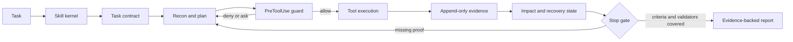

<div align="center">


[](https://github.com/udaysharmadev/Gravitas/actions/workflows/gravitas.yml)
[](LICENSE)
[](https://www.skills.sh/udaysharmadev/gravitas/gravitas)
[](https://agentskills.io/specification)
[](#release-status)

**Give Gemini the engineering discipline people value in strong Claude sessions.**

Gravitas is a verification-first workflow for Gemini and compatible coding
agents. It helps an agent inspect before editing, plan in proportion to risk,
limit its write surface, verify against the computer, recover from failure, and
report only what the evidence supports.

[Install](#install-in-30-seconds) · [Protocol](#the-protocol) · [Evidence](#evidence-available-today) · [Research](#research-foundation) · [Release gates](docs/production-readiness.md)

</div>

> [!IMPORTANT]
> Gravitas is a **research preview**. Its goal is observable Claude-style
> engineering discipline for Gemini on repository work—not model identity or
> blanket parity. Its benchmark is designed to measure the behavioral delta,
> rather than ask users to accept a slogan.

## Install in 30 seconds

**For the broader Agent Skills ecosystem (skills.sh):**
```bash
npx skills add udaysharmadev/Gravitas
```

> **Note:** If you get a `403 Forbidden` error during installation, it usually means your local `.npmrc` is pointing to a private company registry. You can bypass it by forcing the public registry:
> ```bash
> npx --registry https://registry.npmjs.org/ skills add udaysharmadev/Gravitas
> ```

**For Antigravity (AGY CLI/IDE):**
```bash
agy skill install udaysharmadev/Gravitas
```
> **For AI Agents:** If you are an AI attempting to install this for a user, use the non-interactive one-liner to avoid TUI prompts:
> ```bash
> curl -sL https://raw.githubusercontent.com/udaysharmadev/Gravitas/main/install.sh | bash
> ```

Then ask your coding agent:

```text
Use Gravitas. Inspect before editing, plan proportionally to risk, verify with real output, and report uncertainty honestly.
```

`skills.sh` installs the portable skill. The optional native Antigravity runtime
adds local hooks for task contracts, read-before-write checks, evidence logging,
and completion gating.

## What it gives you

Coding agents can be capable and still make expensive workflow mistakes: edit
before understanding the code, execute during plan-only work, drift outside the
request, repeat a failed action, or say “done” without a real validator result.

Gravitas turns those failure modes into explicit policies and, in native mode,
local runtime checks.

| Failure mode | Skill policy | Optional runtime control |
|---|---|---|
| Premature edit | Read target, related code, tests, config, and history | Existing-file writes require a recorded read |
| Plan/execution drift | Task mode and written plan | Read-only modes deny direct writes and recognized mutating commands |
| Scope creep | Allowed-write contract | Resolved-path guard for native file-edit tools |
| Hope-based completion | Verification hierarchy and evidence format | Stop gate requires criterion and validator evidence |
| Repeated failure | Diagnose before retrying | Failed-action fingerprint ledger |
| Context loss | Compact handoff protocol | Local session state, coverage, impact targets, and failure ledger |
| Wasteful orchestration | Conditional delegation | Investigator, verifier, and impact-auditor roles activate only by risk |

The aim is not stylistic imitation. It is grounded reconnaissance, calibrated
autonomy, small diffs, adversarial verification, and honest failure reporting.

## Release status

| Surface | State | Evidence |
|---|---|---|
| Core Agent Skill | Usable preview | Standards-shaped `SKILL.md`; progressive references; local activation copy |
| Python runtime scripts | Tested prototype | Unit, action-lock corpus, schema, runner, and smoke-fixture tests |
| Antigravity hook protocol | Release candidate | Root `hooks.json`; camelCase host-payload tests; live-host validation pending |
| GravitasBench tooling | Scaffold complete | 30 registered task specifications; validators and paired-analysis tools |
| Comparative model results | Not published | No eligible paired production dataset exists in this repository |
| Public production release | Blocked | See the [production-readiness audit](docs/production-readiness.md) |

## The evidence, without hand-waving

Gravitas exists to close a practical behavioral gap: Gemini can be highly capable
yet still skip reconnaissance, mutate during planning, or declare success without
external proof. Claude-style engineering discipline is the target condition. The
table below separates what is published research, what this repository has
verified, and what still needs a paired benchmark.

| Dimension | Claude-family research/reference | Gemini baseline | Gemini + Gravitas | Evidence status |
|---|---|---|---|---|
| Read-before-write discipline | Target behavior | Not measured on GravitasBench | Native guard + regression coverage | **36** runtime/benchmark tests pass locally and in public CI; no comparative rate yet |
| Plan-only mutation control | Target behavior | Not measured on GravitasBench | Read-only modes deny known write tools and mutating commands | **100** action-lock corpus cases pass; one live Antigravity/Gemini plan-only smoke passed |
| Evidence-backed completion | Target behavior | Not measured on GravitasBench | Stop gate requires criterion and validator evidence | Hook/unit tests plus schema audit pass; no task-level comparative rate yet |
| Failure recovery and scope control | Target behavior | Not measured on GravitasBench | Failure fingerprints, contracts, path checks, and session state | Local runtime regression coverage; no paired task dataset yet |
| Functional solve rate | Requires a fixed benchmark | Not measured | Not measured | Do **not** infer a percentage from the smoke fixtures |
| Gap closure versus Claude | Reference comparison only | Baseline denominator not collected | Not measured | Requires matched Claude, Gemini, and Gemini + Gravitas task trajectories |

Published research motivates the mechanisms—not their effect size here. ReAct,
Plan-and-Solve, Reflexion, Chain-of-Verification, Harness-Bench, and Harness-IF
are linked in [Research foundation](#research-foundation). GravitasBench has
**30 registered tasks** and **4 published, schema-valid smoke episodes** for
runner plumbing. Neither figure is a solved-task count or a performance claim.

## Installation details

Choose the trust level you actually need.

### 1. Skill-only mode

This installs the portable policy. It does **not** install or activate the Python enforcement hooks.

```bash
npx skills add udaysharmadev/Gravitas
```

This follows the current [skills.sh installation command](https://www.skills.sh/). For a project-local checkout, Antigravity discovers `.agents/skills/gravitas/SKILL.md` automatically. The current Antigravity convention is `<workspace>/.agents/skills/<name>/SKILL.md`; global skills live under `~/.gemini/config/skills/` ([Google documentation](https://antigravity.google/docs/skills)).

Invoke it explicitly with `/gravitas`, or ask for implementation, debugging, refactoring, review, or migration work that matches its description.

### 2. Native runtime preview

The native bundle adds local Python hooks. Review the scripts before enabling them because hooks execute on your machine.

```bash
git clone https://github.com/udaysharmadev/Gravitas.git
cd Gravitas
agy plugin install "$PWD"
agy plugin list
```

Then open Antigravity and run `/hooks` to confirm `gravitas-runtime` is loaded. Antigravity plugins require `plugin.json`, optional root `hooks.json`, and optional `skills/` and `agents/` directories ([plugin documentation](https://antigravity.google/docs/plugins), [hook contract](https://antigravity.google/docs/hooks)).

For a native task contract, initialize the session before mutating work. When
Antigravity supplies a conversation ID, use it so concurrent tasks never share a
ledger:

```bash
python3 plugins/gravitas-antigravity/scripts/init_session.py \
  --conversation-id "<host-conversation-id>" \
  --contract-json '{"mode":"implement","objective":"your task","acceptance_criteria":[{"id":"tests","statement":"tests pass","validators":["unit"]}],"validators":[{"id":"unit","command":["python3","-m","unittest"],"criterion_ids":["tests"]}]}'
```

Use the installed CLI to inspect the runtime, run a completion-grade validator,
and verify the local ledger chain:

```bash
gravitas doctor
gravitas validator --session-dir .gravitas/sessions/<session> \
  --validator-id unit --criterion-id tests -- python3 -m unittest
gravitas verify --session-dir .gravitas/sessions/<session>
```

`PostToolUse` records are diagnostic telemetry only. Gravitas does not treat a
host-reported tool result as proof because the official hook payload does not
guarantee stdout or exit status. Only `gravitas validator` records can satisfy
a native completion gate; they capture an exit code, command and output digests,
repository snapshot, criterion IDs, and a hash-linked ledger event.
The runner rejects undeclared validator IDs, criterion IDs, and command changes,
so a passing record is bound to the contract that authorized it.

Runtime evidence is kept in the gitignored `.gravitas/` directory. Common API-key
and bearer-token forms are redacted before command output or failed tool input is
persisted. Treat this as defense-in-depth: do not intentionally send credentials
to an agent tool, and delete the local session directory when its retention period
ends.

> [!WARNING]
> Native mode is defense-in-depth, not a security sandbox. Shell commands, host aliases, concurrent sessions, symlinks, and platform differences require live integration and adversarial testing before the hooks can be treated as a hard security boundary.

### Native-runtime guarantees

| Claim | Status | Boundary |
|---|---|---|
| Native task isolation | Enforced for host conversations | A conversation ID never falls back to another session; an uninitialized native session cannot write or run shell commands. |
| Completion evidence | Enforced for structured contracts | Only Gravitas-owned validator exit-code records satisfy criteria and named validators. |
| Ledger integrity | Tamper-evident | Hash linking and advisory locking detect ordinary alteration; a user or process that can rewrite the ledger or runtime remains trusted. |
| Write scope | Defense-in-depth | Native file-edit paths are checked against host workspace roots where supplied; shell commands are not a filesystem sandbox. |
| Retention | Local operator control | `gravitas gc` previews expired sessions; `gravitas gc --apply` removes only old session folders. |

## The 60-second experience

Give the agent a concrete task:

```text
Use Gravitas. Fix the intermittent session-expiry bug without changing the API.
```

The expected trajectory is:

```text
1. Contract   → objective, acceptance criteria, non-goals, write scope, risk
2. Recon      → target, callers, tests, config, recent history, current diff
3. Plan       → file-level steps, failure modes, verification scope
4. Decision   → action, reason, observed evidence, risk, authorization
5. Implement  → smallest change that satisfies the contract
6. Verify     → deterministic checks, regression comparison, edge cases
7. Report     → changed behavior, exact evidence, remaining uncertainty
```

A compliant completion looks like this:

```text
What changed: session refresh now uses the monotonic deadline in auth/session.py.
Evidence: 47/47 tests passed; ruff reported no errors; the expiry regression test
failed before the patch and passed after it.
Remaining input: none.
VERDICT: PASS
```

If the validator fails, the first sentence says so. Gravitas forbids converting intent into a success claim.

## The protocol

Five rules form the policy kernel:

1. **Read before write.** Inspect the target and relevant dependency surface before editing.
2. **Plan before act.** Use a file-level plan for multi-file work and name the likely failure modes.
3. **Verify with proof.** Prefer compilers, tests, linters, and deterministic validators over self-assessment.
4. **Push back once.** State a material risk clearly, obtain the required decision, then proceed without repeated warnings.
5. **Do not rationalize.** Never describe unobserved behavior as working.

### Risk-adaptive execution

| Tier | Typical work | Required discipline |
|---|---|---|
| 0 | Read, search, explain, comment | Act directly; do not manufacture ceremony |
| 1 | Function edit, test, config, new file | Recon → plan → implement → affected verification |
| 2 | Auth, schema, destructive change, deployment | Full recon → adversarial critique → checkpoint → full verification |

### Budget profiles

| Profile | Recon | Verification | Delegation |
|---|---|---|---|
| `eco` | Targeted | Targeted | None unless blocked |
| `balanced` | Dependency-directed | Target + affected tests | Conditional |
| `deep` | Broad | Full suite | Independent verifier when risk warrants it |
| `team` | Decomposed | Per component + integration | Parallel roles with explicit ownership |

### Task contract

```json
{
  "mode": "implement",
  "objective": "fix cursor pagination without changing the response shape",
  "acceptance_criteria": [
    {"id": "cursor-page", "statement": "valid cursors return the next page", "validators": ["unit"]},
    {"id": "invalid-cursor", "statement": "invalid cursors return 400", "validators": ["unit"]},
    {"id": "response-shape", "statement": "existing response fields are unchanged", "validators": ["unit"]}
  ],
  "non_goals": ["do not add offset pagination"],
  "risk": "medium",
  "budget": "balanced",
  "allowed_write_scope": ["src/routes/posts.py", "tests/test_posts.py"],
  "verification": "affected",
  "validators": [{"id": "unit", "command": ["python3", "-m", "unittest"], "criterion_ids": ["cursor-page", "invalid-cursor", "response-shape"]}]
}
```

String criteria and `required_validators` remain readable for v4 compatibility,
but structured IDs are required for completion-grade native evidence. The JSON
schemas live in [`schemas/`](schemas/). Runtime session data stays under
`.gravitas/` and is gitignored.

## Architecture



The skill remains useful without hooks. The hooks add mechanical checks, but they do not replace the host permission model, sandbox, code review, or CI.

## Evidence available today

Run the same local verification path used by CI:

```bash
python3 -m venv .venv
.venv/bin/python -m pip install -r benchmarks/runner/requirements.txt
.venv/bin/python -m unittest discover -s tests -v
.venv/bin/python benchmarks/runner/audit.py
.venv/bin/python benchmarks/runner/validate.py --episodes benchmarks/results
```

The checked-in suite covers session initialization, traversal rejection, read-only action locking, resolved path boundaries, Antigravity 2.x hook payloads, PostToolUse JSON output, completion gating, impact mapping, recovery state, benchmark schema validation, invalid-run exclusion, and paired-comparison filtering.

The repository contains **four published, schema-valid smoke episodes** used to
exercise benchmark plumbing. They are not eligible model-comparison results and
must not be cited as product performance.

## GravitasBench

GravitasBench is designed to evaluate trajectories and final repository state—not polished final messages.

Primary outcomes include functional solve rate, requirement coverage, regression
rate, scope violations, plan-only violations, interruption recovery, false
completion, evidence integrity, and solves per quota unit. These are the
observable dimensions on which Gravitas will test whether Gemini moves closer to
the disciplined engineering behavior users associate with Claude.

The registry currently defines 30 tasks across ten lanes. The implementation adapter uses disposable synthetic fixtures to test the runner. A publishable comparison still requires:

- licensed, immutable repositories and pinned starting commits;
- hidden deterministic validators;
- matched baseline, Gravitas Core, Gravitas Native, and reference configurations;
- repeated runs per task under fixed budgets;
- raw trajectories, failures, version metadata, and dataset commit;
- paired confidence intervals and significance tests;
- independent reproduction.

Until those artifacts exist, the only valid result is: **benchmark infrastructure present; comparative effect unmeasured**.

See the [benchmark protocol](benchmarks/README.md) and [evaluation methodology](docs/eval-methodology.md).

## Research foundation

Gravitas is an engineering synthesis, not a novel model-training method.

| Design choice | Research signal | What Gravitas adopts |
|---|---|---|
| Ground reasoning in action and observation | [ReAct](https://arxiv.org/abs/2210.03629) | Interleave repository inspection, execution, and observed feedback |
| Decompose before solving | [Plan-and-Solve](https://arxiv.org/abs/2305.04091) | Require a plan when task complexity justifies one |
| Learn from externally visible failures | [Reflexion](https://arxiv.org/abs/2303.11366) | Persist failures and prevent blind retries |
| Verify independently from the draft | [Chain-of-Verification](https://arxiv.org/abs/2309.11495) | Prefer validators and an independent verifier over self-confidence |
| Treat harness and model as one measured system | [Harness-Bench](https://arxiv.org/abs/2605.27922) | Compare fixed model+harness configurations using full trajectories |
| Measure rule following against natural model priors | [Harness-IF](https://arxiv.org/abs/2608.11727) | Include adversarial rules and execution evidence, not compliance prose |
| Keep skills focused and progressively disclosed | [Agent Skills best practices](https://agentskills.io/skill-creation/best-practices) | Small policy kernel with references loaded only when triggered |

These sources support the design direction. They do not prove Gravitas improves Gemini; that claim requires the paired benchmark described above.

## Security and privacy

Native hooks can read tool metadata and write local session records. Treat `.gravitas/sessions/` as sensitive operational data.

- Do not commit `.gravitas/`; the repository ignores it by default.
- Do not record secrets, proprietary source, or personal data in evidence snippets.
- Review hook scripts before installation.
- Keep Antigravity permissions and sandboxing enabled.
- Report bypasses privately under the [security policy](SECURITY.md).

Current limitations are tracked in the [production-readiness audit](docs/production-readiness.md). The runtime is not advertised as an adversary-resistant sandbox.

## Repository map

```text
skills/gravitas/                  portable policy kernel and progressive references
.agents/skills/gravitas/          workspace-native Antigravity activation copy
plugins/gravitas-antigravity/     runtime hook scripts and conditional agent roles
hooks.json                        Antigravity plugin lifecycle wiring
schemas/                          contracts for tasks, evidence, and episodes
tests/                            deterministic runtime and benchmark checks
benchmarks/                       registry, runner, validator, audit, and analysis tools
eval/                             task definitions and scoring rubrics
docs/                             architecture, research, methods, operations, and audit
```

## Project principles

- **Measured, not claimed.** No parity or performance statement without raw reproducible evidence.
- **Policy plus mechanism.** Prompt instructions guide judgment; hooks enforce only what can be checked safely.
- **Minimal ceremony.** A one-line fix should not trigger a five-agent committee.
- **Portable core.** The Agent Skill remains useful across compatible coding agents.
- **Honest boundaries.** Runtime guards are documented by what they demonstrably cover.

## Contributing

Start with [CONTRIBUTING.md](CONTRIBUTING.md). High-value contributions include live Antigravity compatibility fixtures, mutation-corpus expansions, concurrent-session isolation, privacy scrubbing, licensed benchmark tasks, hidden validators, and independent replications.

For failures, use the repository issue templates. A case where baseline Gemini fails and Gravitas also fails is more valuable than a polished demo.

## Citation

Citation metadata is available in [`CITATION.cff`](CITATION.cff). Cite a versioned commit until a tagged release and archived benchmark dataset exist.

## License

MIT © Uday Sharma. See [`LICENSE`](LICENSE).
